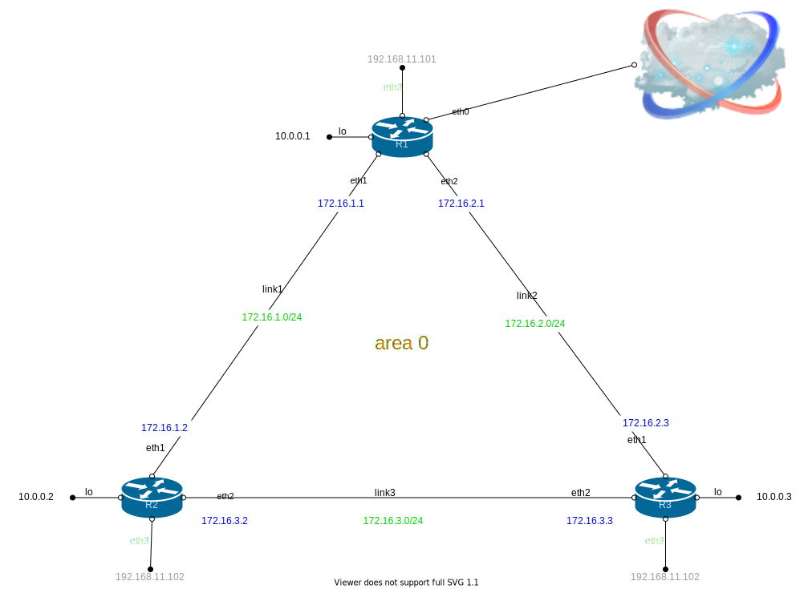
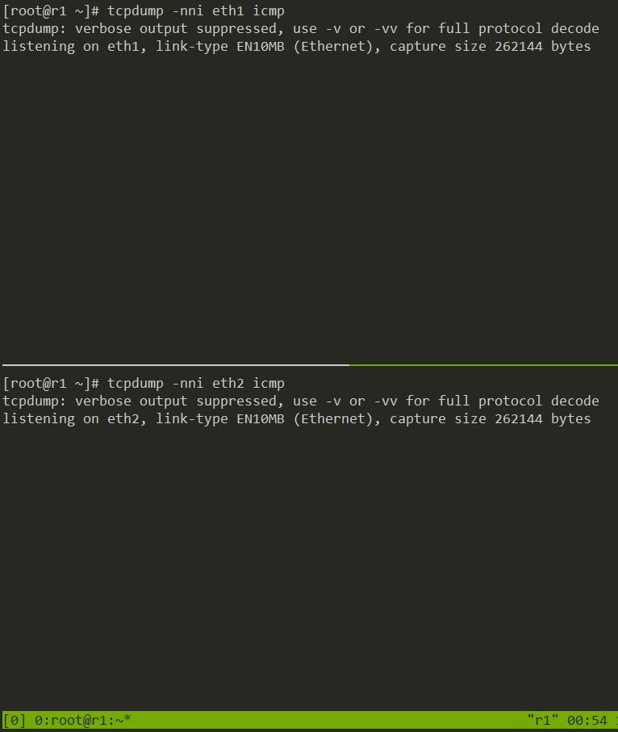
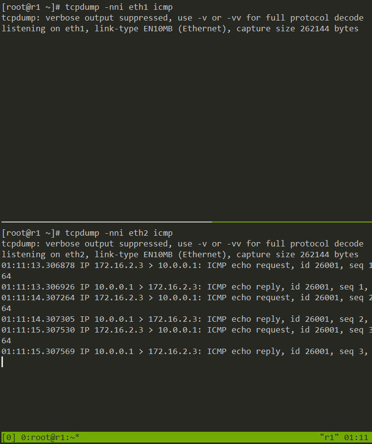
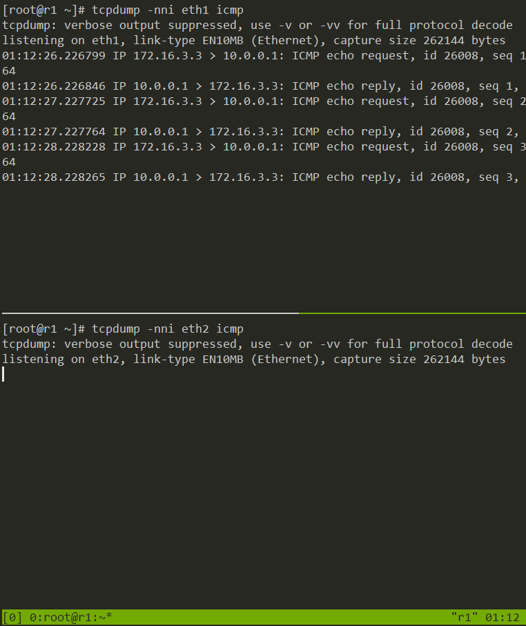
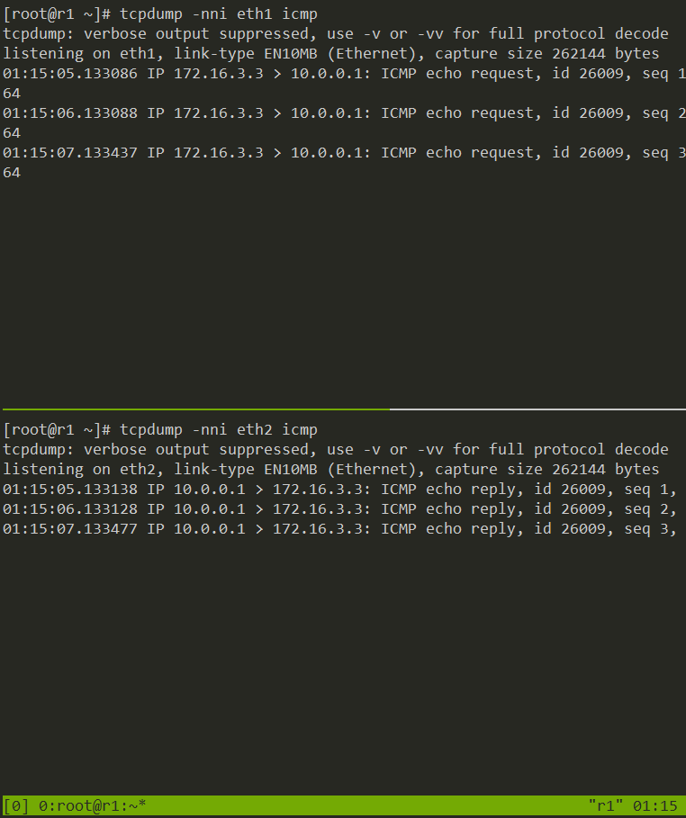
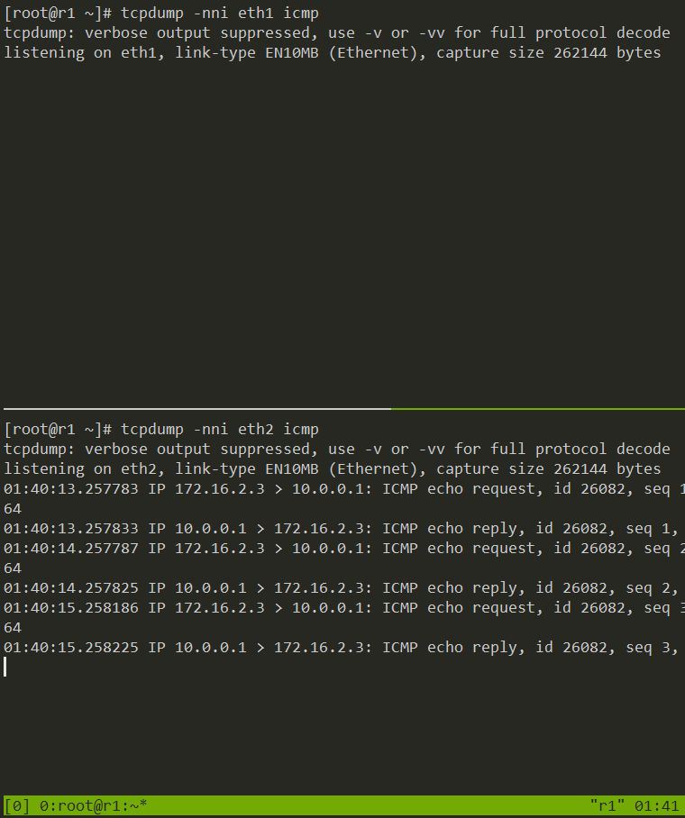
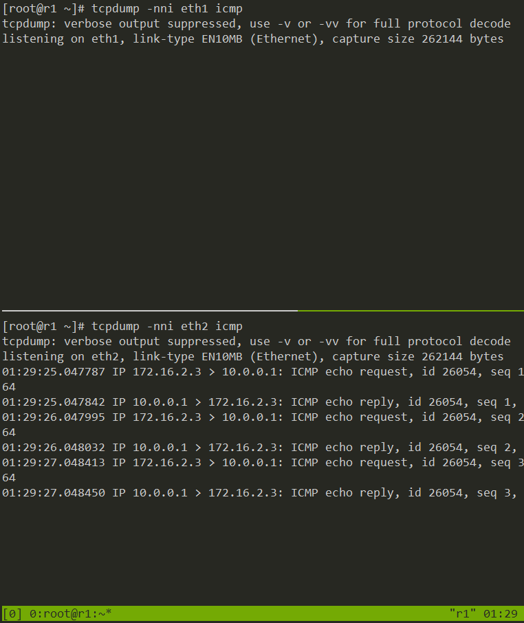

# Статическая и динамическая маршрутизация


## Задачи

1. Развернуть 3 виртуальных машины;
2. Объединить эти виртуальные машины разными виртуальными каналами;
3. Настроить OSPFv2 между виртуальными машинами на базе quagga;
4. Настроить асимметричную маршрутизацию;
5. Восстановить симметричную маршрутизацию не уменьшая цену интерфейса из п.4.


## Выполнение

Поднято три виртуальные машины посредством Vagrantfile и настроены посредством Ansible, в т.ч.:
- машины объединены тремя разными виртуальными каналами
- настроен OSPFv2 между виртуальными машинами на базе quagga
- в изначальной конфигурации настроена симметричная маршрутизация





Таблица соответствия каналов и адресов.  
| Канал | Адресация |
|-------|-----------|
| ISP   | DHCP client    |
| link1 | 172.16.1.0/24 |
| link2 | 172.16.2.0/24 |
| link3 | 172.16.3.0/24 |
  
Таблица адресов на интерфейсах устройств.  
| Устройство | Интерфейс | Адрес |
|------------|-----------|-------|
| R1 | lo | 10.0.0.1/32 | 
| R1 | eth0 | vagrant DHCP | 
| R1 | eth1 | 172.16.1.1/24 |
| R1 | eth2 | 172.16.2.1/24 | 
| R1 | eth3 | Ansible config interface | 
| R2 | lo | 10.0.0.2/32 | 
| R2 | eth0 | vagrant DHCP | 
| R2 | eth1 | 172.16.1.2/24 |
| R2 | eth2 | 172.16.3.2/24 | 
| R2 | eth3 | Ansible config interface | 
| R3 | lo | 10.0.0.3/32 | 
| R3 | eth0 | vagrant DHCP | 
| R3 | eth1 | 172.16.2.3/24 |
| R3 | eth2 | 172.16.3.3/24 | 
| R3 | eth3 | Ansible config interface | 


### Проверка симметричности маршрутизации

До проведения изменений посмотрю состояние маршрутов на __r3__
```
[root@r3 ~]# vtysh

Hello, this is Quagga (version 0.99.22.4).
Copyright 1996-2005 Kunihiro Ishiguro, et al.

r3# sh ip ro
Codes: K - kernel route, C - connected, S - static, R - RIP,
       O - OSPF, I - IS-IS, B - BGP, A - Babel,
       > - selected route, * - FIB route

O   0.0.0.0/0 [110/10] via 172.16.2.1, eth1, 00:00:24
K>* 0.0.0.0/0 via 172.16.2.1, eth1
O>* 10.0.0.1/32 [110/20] via 172.16.2.1, eth1, 00:00:25
O>* 10.0.0.2/32 [110/20] via 172.16.3.2, eth2, 01:15:34
O   10.0.0.3/32 [110/10] is directly connected, lo, 01:15:41
C>* 10.0.0.3/32 is directly connected, lo
C>* 10.0.2.0/24 is directly connected, eth0
C>* 127.0.0.0/8 is directly connected, lo
O>* 172.16.1.0/24 [110/20] via 172.16.2.1, eth1, 00:00:25
  *                        via 172.16.3.2, eth2, 00:00:25
O   172.16.2.0/24 [110/10] is directly connected, eth1, 00:00:25
C>* 172.16.2.0/24 is directly connected, eth1
O   172.16.3.0/24 [110/10] is directly connected, eth2, 01:15:41
C>* 172.16.3.0/24 is directly connected, eth2
C>* 192.168.11.0/24 is directly connected, eth3
```

Ставлю интерфейсы на __r1__ на прослушивание




Запускаю пинг на __r3__
```
[root@r3 ~]# ping 10.0.0.1 -c3
PING 10.0.0.1 (10.0.0.1) 56(84) bytes of data.
64 bytes from 10.0.0.1: icmp_seq=1 ttl=63 time=0.563 ms
64 bytes from 10.0.0.1: icmp_seq=2 ttl=63 time=0.534 ms
64 bytes from 10.0.0.1: icmp_seq=3 ttl=63 time=0.651 ms

--- 10.0.0.1 ping statistics ---
3 packets transmitted, 3 received, 0% packet loss, time 2001ms
rtt min/avg/max/mdev = 0.534/0.582/0.651/0.057 ms
```

Смотрю результаты tcpdump на __r1__




В обоих направлениях пакеты идут по одному и тому же маршруту - кратчайшему.

### Нарушение симметричности маршрутизации

На __r1__ изменяю стоимость интерфейса на кратчайшем маршруте к публичной сети
```
r3# conf t
r3(config)# int eth1
r3(config-if)# ip os co 1000
```

Смотрю как это отразилось на маршрутах:
```
r3# sh ip ro
Codes: K - kernel route, C - connected, S - static, R - RIP,
       O - OSPF, I - IS-IS, B - BGP, A - Babel,
       > - selected route, * - FIB route

O   0.0.0.0/0 [110/10] via 172.16.3.2, eth2, 00:00:58
K>* 0.0.0.0/0 via 172.16.2.1, eth1
O>* 10.0.0.1/32 [110/30] via 172.16.3.2, eth2, 00:00:59
O>* 10.0.0.2/32 [110/20] via 172.16.3.2, eth2, 01:18:33
O   10.0.0.3/32 [110/10] is directly connected, lo, 01:18:40
C>* 10.0.0.3/32 is directly connected, lo
C>* 10.0.2.0/24 is directly connected, eth0
C>* 127.0.0.0/8 is directly connected, lo
O>* 172.16.1.0/24 [110/20] via 172.16.3.2, eth2, 00:00:59
O   172.16.2.0/24 [110/30] via 172.16.3.2, eth2, 00:00:59
C>* 172.16.2.0/24 is directly connected, eth1
O   172.16.3.0/24 [110/10] is directly connected, eth2, 01:18:40
C>* 172.16.3.0/24 is directly connected, eth2
C>* 192.168.11.0/24 is directly connected, eth3
```

Вижу, что не стало маршрута
```
172.16.1.0/24 via 172.16.2.1, eth1
```

Аналогично предыдущей проверке запускаю tcpdump на __r1__ и ping на __r2__ и смотрю результат




Дополнительно пробую на __r2__ увеличить стоимость интерфейса eth2
```
r2# conf t
r2(config)# int eth2
r2(config-if)# ip os co 1000
```

Повторяю проверку и получаю результат




Здесь видно, что в разном направлении пакеты ходят разными маршрутами.

Возвращаю изначальные настройки на __r2__
```
r2# conf t
r2(config)# int eth2
r2(config-if)# no ip os co 1000
```

### Восстановление симметричности при сохранении увеличенной стоиомости интерфейса

* Вариант первый

Выключаю "дешевый" интерфейс на __r3__
```
[root@r3 ~]# ip link set eth2 down
```

Проверяю




Результат очевиден.


Восстанавливаю eth2 на __r3__
```
[root@r3 ~]# ip link set eth2 up
```

Смотрю маршруты
```
r3# sh ip ro
Codes: K - kernel route, C - connected, S - static, R - RIP,
       O - OSPF, I - IS-IS, B - BGP, A - Babel,
       > - selected route, * - FIB route

O   0.0.0.0/0 [110/10] via 172.16.2.1, eth1, 00:00:26
K>* 0.0.0.0/0 via 172.16.2.1, eth1
O>* 10.0.0.1/32 [110/1010] via 172.16.2.1, eth1, 00:00:27
O>* 10.0.0.2/32 [110/1020] via 172.16.2.1, eth1, 00:00:27
O   10.0.0.3/32 [110/10] is directly connected, lo, 02:16:39
C>* 10.0.0.3/32 is directly connected, lo
C>* 10.0.2.0/24 is directly connected, eth0
C>* 127.0.0.0/8 is directly connected, lo
O>* 172.16.1.0/24 [110/1010] via 172.16.2.1, eth1, 00:00:27
O   172.16.2.0/24 [110/1000] is directly connected, eth1, 00:00:27
C>* 172.16.2.0/24 is directly connected, eth1
O>* 172.16.3.0/24 [110/1020] via 172.16.2.1, eth1, 00:00:27
C>* 192.168.11.0/24 is directly connected, eth3
```

* Вариант второй

Прописываю принудительный маршрут до 10.0.0.1
```
[root@r3 ~]# ip route add 10.0.0.1/32 via 172.16.2.1 dev eth1
```
Проверяю




Смотрю маршруты
```
r3# sh ip ro
Codes: K - kernel route, C - connected, S - static, R - RIP,
       O - OSPF, I - IS-IS, B - BGP, A - Babel,
       > - selected route, * - FIB route

O   0.0.0.0/0 [110/10] via 172.16.3.2, eth2, 00:07:51
K>* 0.0.0.0/0 via 172.16.2.1, eth1
K>* 10.0.0.1/32 via 172.16.2.1, eth1
O   10.0.0.1/32 [110/30] via 172.16.3.2, eth2, 00:07:52
O>* 10.0.0.2/32 [110/20] via 172.16.3.2, eth2, 00:07:52
O   10.0.0.3/32 [110/10] is directly connected, lo, 02:14:43
C>* 10.0.0.3/32 is directly connected, lo
C>* 10.0.2.0/24 is directly connected, eth0
C>* 127.0.0.0/8 is directly connected, lo
O>* 172.16.1.0/24 [110/20] via 172.16.3.2, eth2, 00:07:52
O   172.16.2.0/24 [110/30] via 172.16.3.2, eth2, 00:07:52
C>* 172.16.2.0/24 is directly connected, eth1
O   172.16.3.0/24 [110/10] is directly connected, eth2, 00:07:52
C>* 172.16.3.0/24 is directly connected, eth2
C>* 192.168.11.0/24 is directly connected, eth3
```

Итого, оба варианта работают. Но оба варианта сводят на нет плюсы динамической маршрутизации, т.к. при любых нарушениях доступности на оставшемся маршруте, будет полностью потеряна связность.


## Примечание
- Почему-то не отрабатывал handler рестарта сети в таске удаления дефолтного маршрута с eth0, пришлось прибегнуть к перезагрузке хостов.
- Не получилось использовать модуль seboolean, не нашлись необходимые пакеты libselinux-python и  libsemanage-python - по всей видимости из-за того, что хостовая система debian-based.
- В перспективе необходимо будет переписать ansible-конфигурацию на playbook вместо ролей, т.к. в ролях получается слишком много повторяющегося кода.


